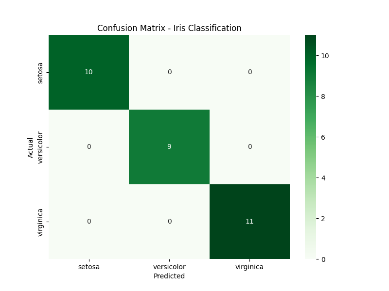

# Iris Flower Classification

## CodeAlpha Data Science Internship — Task 1

### Project Overview
A machine learning model that classifies Iris flowers into three species (Setosa, Versicolor, Virginica) based on sepal and petal measurements.

### Dataset
* **Source:** Scikit-learn Built-in Iris Dataset
* **Details:** 150 samples, 3 species, 4 features

### Steps Performed
1. **Data Loading:** Used Pandas to handle the dataset.
2. **EDA:** Visualized feature relationships using Seaborn & Matplotlib.
3. **Train/Test Split:** Divided data (80/20) for fair evaluation.
4. **Model Training:** Trained a **Random Forest Classifier** (100 trees).
5. **Evaluation:** Achieved 100% accuracy on the test set.

### Results
* **Model Accuracy:** 100%
* **Confusion Matrix:** Zero misclassifications across all 30 test samples.

### Libraries Used
* Pandas
* Scikit-learn
* Matplotlib
* Seaborn

### Author
**Syed Fazeel Ahmed** — Data Science Intern at CodeAlpha
